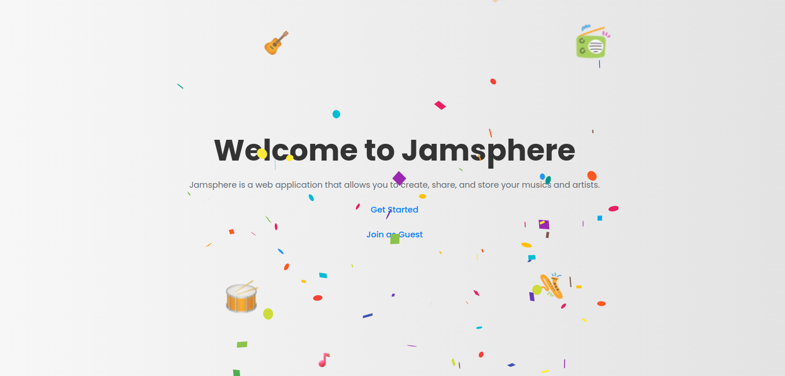

# Jamsphere

Jamsphere is a music management application that allows users to manage their songs. This project uses React for the frontend, Redux for state management, and Node.js with Express and MongoDB for the backend.




## Table of Contents

- [Installation](#installation)
- [Usage](#usage)
- [Project Structure](#project-structure)
- [Features](#features)
- [API Endpoints](#api-endpoints)
- [Testing](#testing)
- [Contributing](#contributing)
- [License](#license)

## Installation

### Prerequisites

- Node.js (v14 or higher)
- npm (v6 or higher)
- MongoDB (v4 or higher)

### Backend Setup

1. Clone the repository:

   ```bash
   git clone https://github.com/kirubel-web/JamSphere.git
   cd JamSphere/jamsphere-backend
   ```

2. Install dependencies:

   ```bash
   npm install
   ```

3. Create a `.env` file in the `backend` directory and add your MongoDB URI:

   ```env
   MONGODB_URI=mongodb://127.0.0.1:27017/your_database_name || use atlas URI from Mongodb
   JWT_TOKEN=youcanputhere
   ```

4. Start the backend server:

   ```bash
   node server.js
   ```

### Frontend Setup

1. Navigate to the `frontend` directory:

   ```bash
   cd ../jamsphere
   ```

2. Install dependencies:

   ```bash
   npm install
   ```

3. Start the frontend development server:

   ```bash
   npm run dev
   ```

## Usage

1. Ensure MongoDB is running.
2. Start the backend server.
3. Start the frontend development server.
4. Open your browser and navigate to `http://localhost:5173`.

## Project Structure

### Backend

```
backend/
├── config/
│   └── db.js
├── controllers/
│   └── authController.js
├── middleware/
│   └── authMiddleware.js
├── models/
│   └── Song.js
│   └── User.js
├── routes/
│   └── auth.js
│   └── songs.js
├── test/
│   └── auth.test.mjs
├── .env
├── server.js
└── package.json
```

### Frontend

```
frontend/
├── src/
│   ├── components/
│   │   └── Button.jsx
│   │   └── Login.jsx
│   │   └── SignUp.jsx
│   │   └── SongForm.jsx
│   │   └── SongItem.jsx
│   │   └── SongList.jsx
│   │   └── styles.css
│   │   └── Teaser.jsx
│   ├── context/
│   │   └── AuthContext.jsx
│   ├── pages/
│   │   └── HomePage.jsx
│   ├── redux/
│   │   ├── songs/
│   │   │   ├── songsSlice.jsx
│   │   └── store.js
│   │   └── rootReducer.js
│   ├── styles/
│   │   └── GlobalStyles.js
│   │   └── theme.js
│   ├── App.jsx
│   ├── index.jsx
│   └── styles/
│       └── global.css
├── public/
│   └── index.html
└── package.json
```

## Features

- **User Authentication**: Secure login and registration.
- **Song Management**: Add, update, delete, and view songs.
- **State Management**: Efficient state management using Redux.
- **API Integration**: Seamless integration with a RESTful API.

## API Endpoints

### Songs

- `GET /api/songs`: Get all songs for a user.
- `POST /api/songs`: Add a new song for a user.
- `PUT /api/songs/:songId`: Update a song.
- `DELETE /api/songs/:songId`: Delete a song.

## Testing

### Backend

1. Install Chai and mocha:

   ```bash
   npm install --save-dev chai-mocha
   ```

2. Run tests:

   ```bash
   npm test
   ```


## Contributing

1. Fork the repository.
2. Create a new branch (`git checkout -b feature/your-feature`).
3. Commit your changes (`git commit -am 'Add some feature'`).
4. Push to the branch (`git push origin feature/your-feature`).
5. Create a new Pull Request.

## License

This project is licensed under the MIT License - see the LICENSE file for details.
